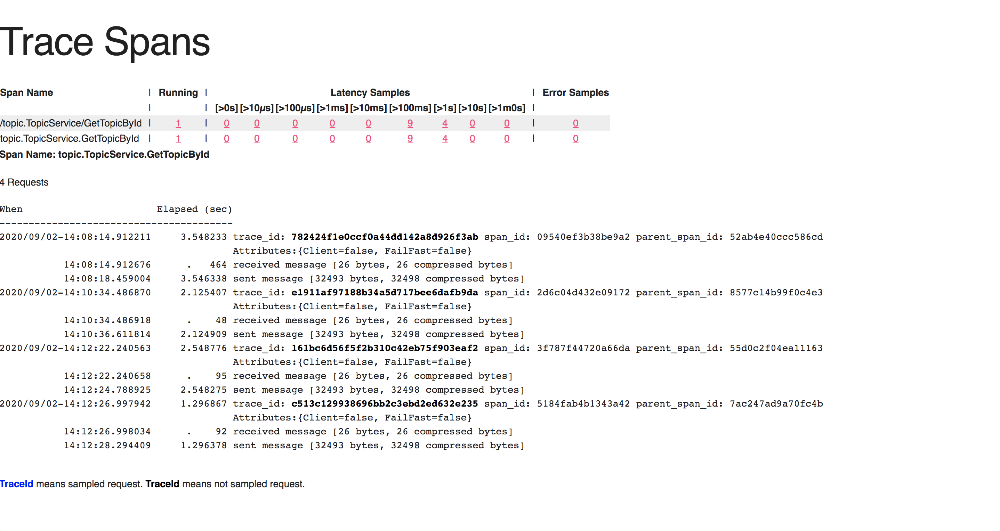

# grpc-go-cnode

[](https://goreportcard.com/report/github.com/mrdulin/grpc-go-cnode)


A Go gRPC server for [CNode](https://cnodejs.org) community built on the top of [RESTful API](https://cnodejs.org/api).

*This project is just for teaching, NOT production ready.*

After modifying the `.proto` files, need to re-compile protocol buffers.
It will generate the service interfaces, models for the server side and service interfaces for client side.
Then, you can implement the interfaces of the services.

Features:

* HTTPs server and gRPC server share same listening address and port.
* Print access logs in unary call interceptor
* gRPC Health check for entire server based on [GRPC Health Checking Protocol](https://github.com/grpc/grpc/blob/master/doc/health-checking.md)
* Per RPC call authentication, check [auth.go](./internal/utils/auth/auth.go)
* TLS connection with self-signed credentials
* Support constraint rules and validators for Protocol buffer, check [here](./internal/protobufs/user/service.proto)
* Server reflection, check [GRPC Server Reflection Protocol](https://github.com/grpc/grpc/blob/master/doc/server-reflection.md)
* Integration and unit testings.

Compile protocol buffers:

```bash
make compile-protobuf
```

Don't support read environment variables from OS. Only support read environment variables from `configs/config.yaml`:
```yaml
BASE_URL: https://cnodejs.org/api/v1
PORT: 3000
ACCESS_TOKEN: <YOUR_ACCESS_TOKEN>
GRPC_GO_LOG_SEVERITY_LEVEL: info
GRPC_GO_LOG_VERBOSITY_LEVEL: 1
```

Start the HTTPs server and gRPC server:
```bash
make start
```

Run integration testings:

1. Run `make start` to start the server
2. Run `make test-integration`

Run unit testings:

```bash
make test-unit
```

List all gRPC services using [grpcurl](https://github.com/fullstorydev/grpcurl), using `-insecure` flag to skip server certificate and domain verification.

```bash
☁  grpc-go-cnode [master] grpcurl -insecure localhost:3000 list
grpc.health.v1.Health
grpc.reflection.v1alpha.ServerReflection
topic.TopicService
user.UserService
```

Or using `-cacert` flag to use a file containing trusted root certificates for verifying the server.

```bash
☁  grpc-go-cnode [master] grpcurl -cacert=./assets/server.crt localhost:3000 list
grpc.health.v1.Health
grpc.reflection.v1alpha.ServerReflection
topic.TopicService
user.UserService
```

You will see traces and stats exported on the stdout. You can also see the z-pages provided from the server:

- Traces: http://localhost:8081/debug/tracez
- RPCs: http://localhost:8081/debug/rpcz

E.g. Server side gRPC server traces:



More info, see [Makefile](./Makefile)
